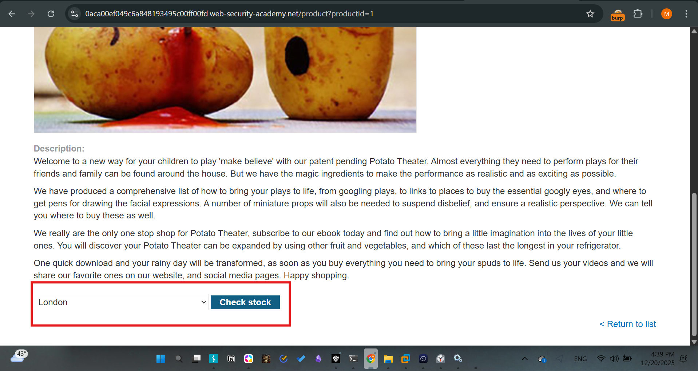
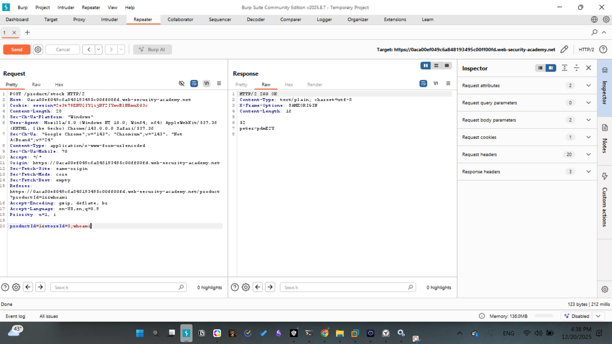
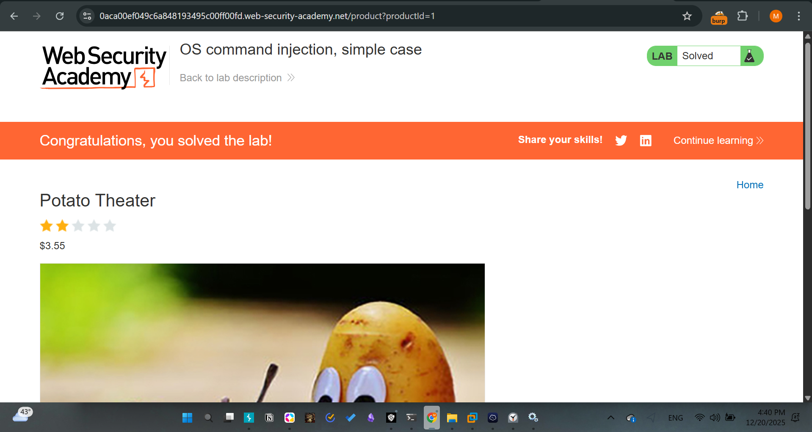

# Lab - 01: OS command injection, simple case

## Challenge Description
The product stock checker executes a shell command containing user-supplied product and store IDs. Since the output is returned in the response, we can use a command separator to execute arbitrary commands.

## Methodology
1. **Intercept Request:** Capture the `POST /product/stock` request in Burp Suite.
2. **Identify Vector:** The `storeID` parameter is passed to a shell command.
3. **Inject Command:** Use the `;` character to chain the `whoami` command.

## Exploitation
**Payload used:** `productId=1&storeId=1;whoami`

The server executes the internal command, and the output of `whoami` is reflected in the HTTP response.

# ScreenShots

## Mitigation
- Use built-in API functions instead of invoking shell commands.
- Implement strict input validation (whitelist) for the `storeID` parameter.