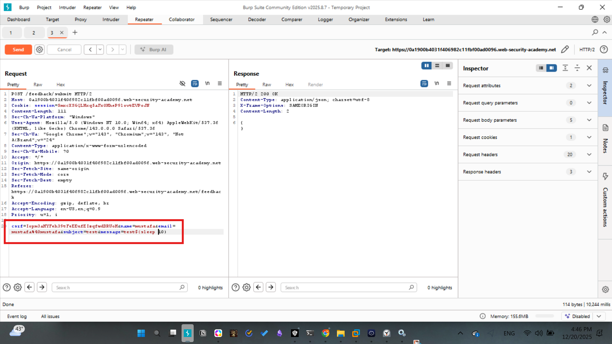
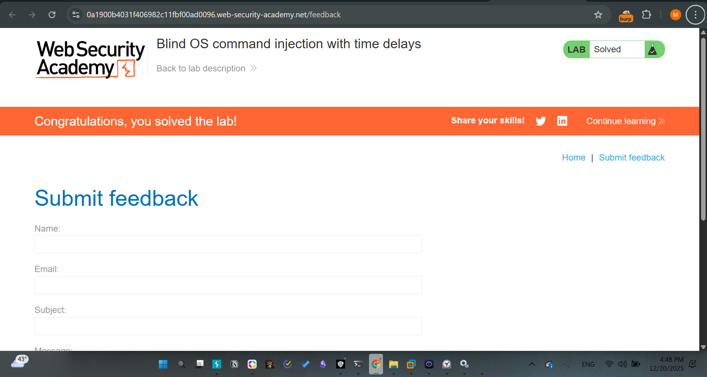

# Lab - 02: Blind OS command injection with time delays

## Challenge Description
The feedback function executes a shell command with user-supplied details, but the output is not returned (Blind SQLi). We must confirm the vulnerability by inducing a time delay.

## Methodology
1. **Intercept Request:** Capture the feedback submission (`POST /feedback/submit`).
2. **Identify Vector:** The `message` field is a candidate for shell injection.
3. **Trigger Delay:** Use the `sleep` command with the `10` seconds to make the server wait for a specific number of seconds.

## Exploitation
**Payload used:** `message=x$(sleep 10)`

By monitoring the "Response Received" time in Burp Suite, I confirmed that the server took ~10 seconds to respond, verifying the command execution.

# Screenshots

## Mitigation
- Sanitize all user input using a library that escapes shell metacharacters.
- Use parameterized system calls or avoid shell execution entirely.