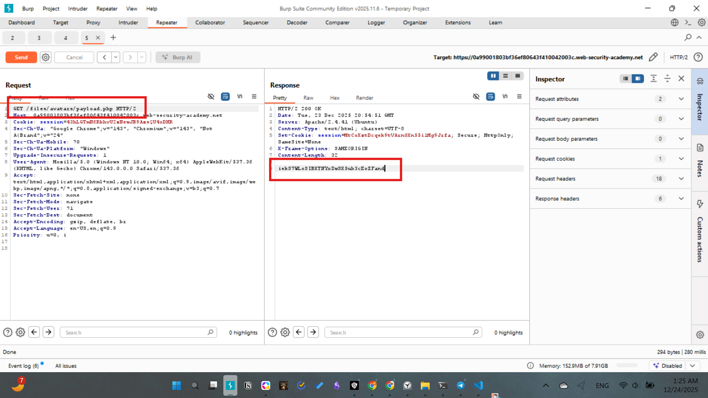
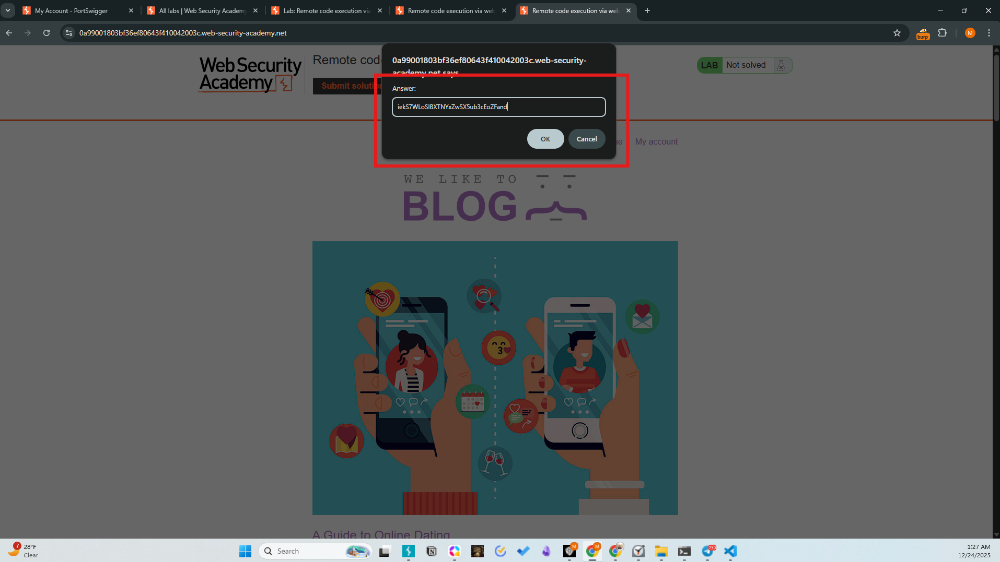
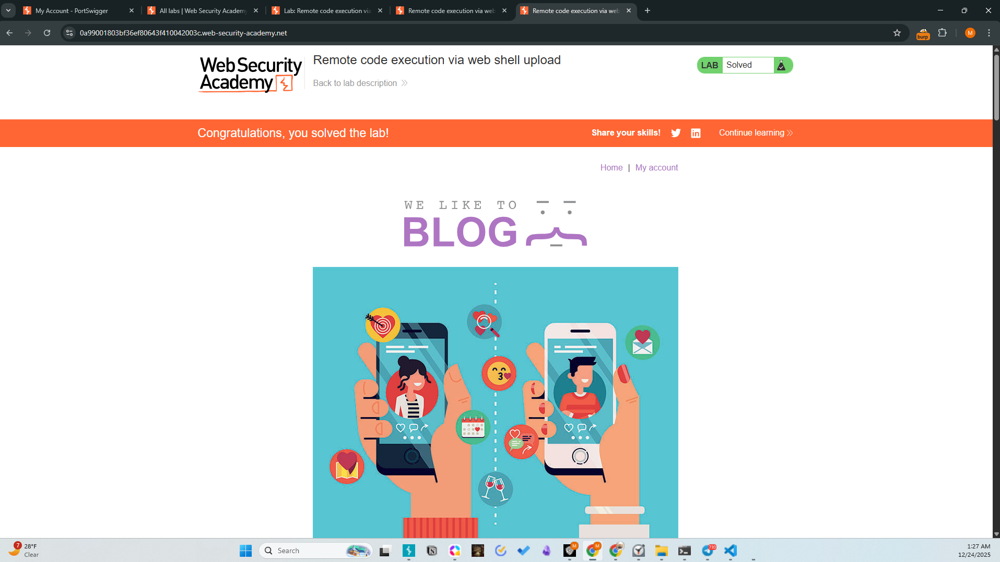

# Lab-01: Remote code execution via web shell upload
- Difficulty: Apprentice
- Category: File Upload Vulnerabilities

# Description
The application allows users to upload profile pictures without validating the file type or content. This allows an attacker to upload a server-side script (PHP) and execute arbitrary code.

# Methodology
1. Initial Access: Authenticated as wiener:peter.
2. Vulnerability Identification: Observed the avatar upload feature in the account profile section.
3. Exploitation:
- Created a file named payload.php containing <?php echo file_get_contents('/home/carlos/secret'); ?>.
- Uploaded the file via the avatar upload form.
- Accessed the file at /files/avatars/payload.php to trigger execution.
4. Exfiltration: The server executed the PHP code and returned the contents of the secret file in the HTTP response.


# Payload
```php
<?php echo file_get_contents('/home/carlos/secret'); ?>
```

# Screenshots



