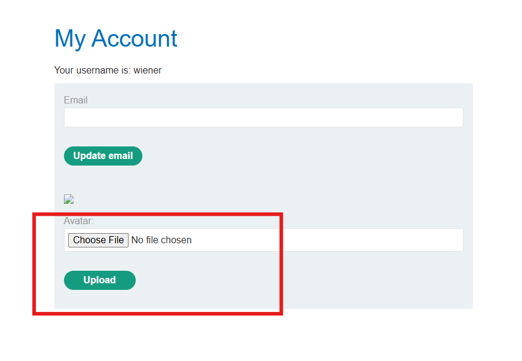
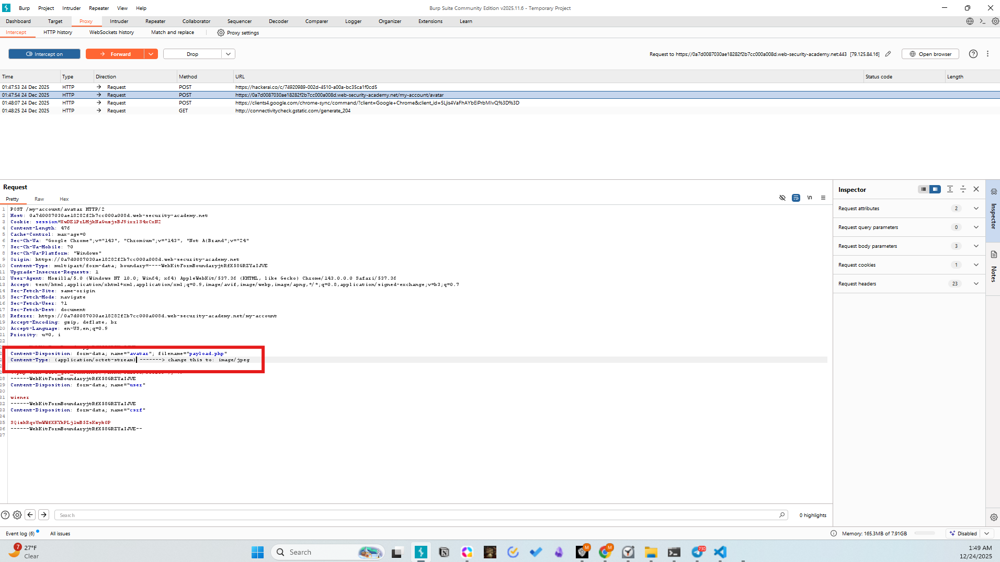
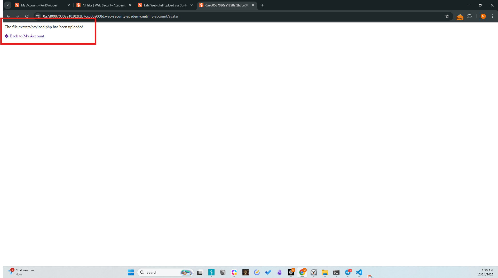
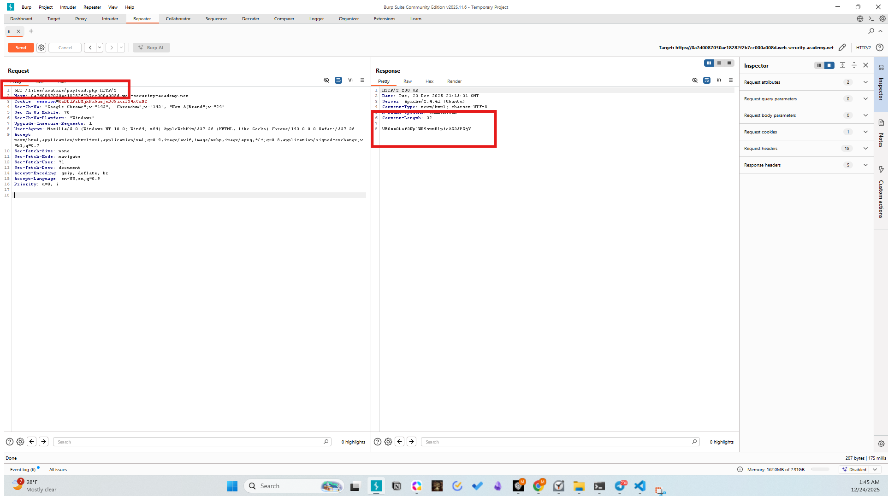
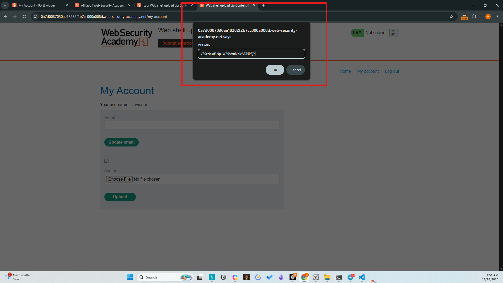
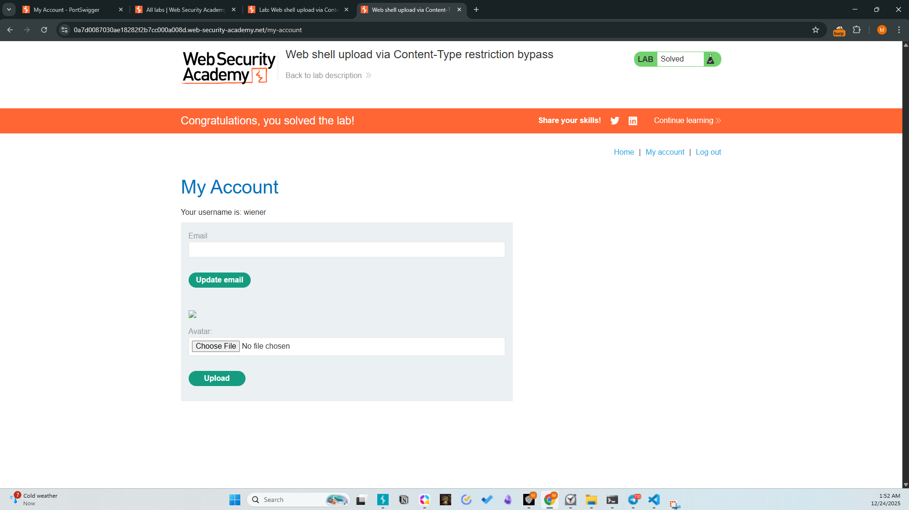

# Lab - 02: Web shell upload via Content-Type restriction bypass
Difficulty: Apprentice
Category: File Upload Vulnerabilities

# Description
The application attempts to restrict file uploads by checking the Content-Type header provided by the client. However, it fails to perform server-side validation of the actual file content or extension, allowing attackers to spoof the header.

# Methodology
1. Initial Access: Authenticated as wiener:peter.
2. Identification: Attempted to upload payload.php, which initially might be flagged or simply tested for header reliance.
3. Exploitation:
- Intercepted the upload request using Burp Suite.
- Located the Content-Type: application/x-php header in the multi-part form data.
- Changed the header value to image/jpeg.
- Forwarded the request.
4. Exfiltration: The server accepted the payload. Accessed /files/avatars/payload.php to retrieve the secret contents of /home/carlos/secret.

# Payload
```http
Content-Type: image/jpeg
```
(Used to mask the PHP script during the POST request)

# Screenshots





