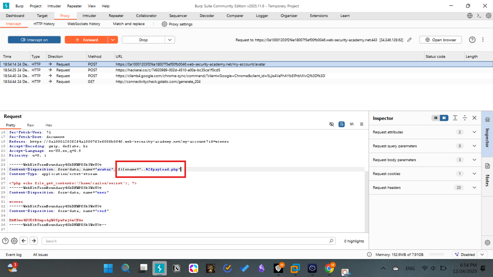
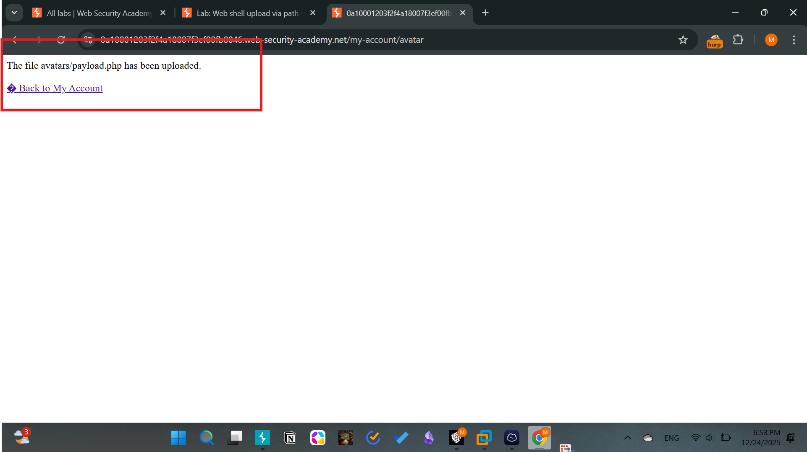
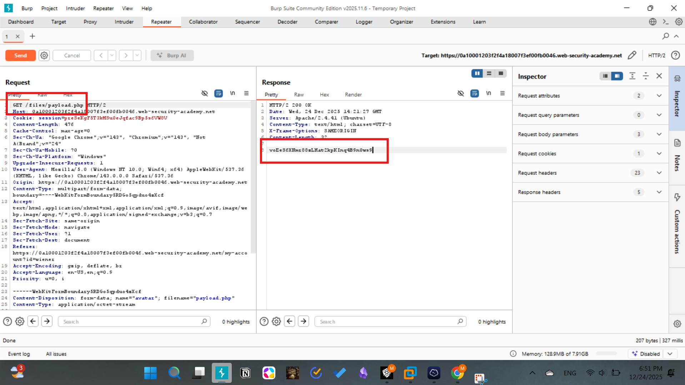
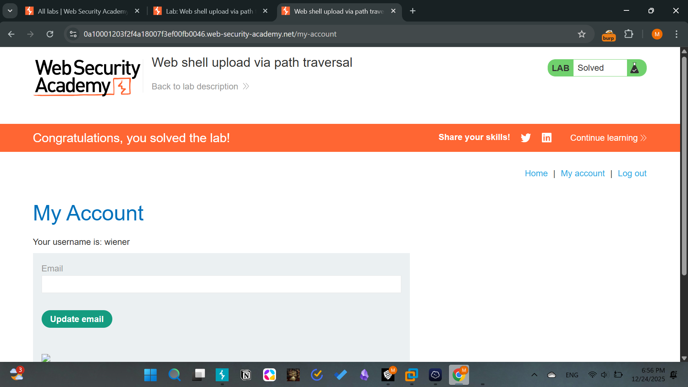

# Lab - 03: Web shell upload via path traversal
Difficulty: Practitioner
Category: File Upload / Path Traversal

# Description
The application allows file uploads but prevents the execution of scripts within the designated /avatars directory (likely through a web server configuration like php_admin_value engine Off or a <Directory> block). This restriction can be bypassed by exploiting a path traversal vulnerability in the filename parameter to place the web shell in a parent directory where execution is permitted.

# Methodology
1. Initial Access: Authenticated as wiener:peter.
2. Analysis:
- Uploading payload.php directly to /files/avatars/ results in the server returning the file's source code as plaintext instead of executing it.
- This indicates a security policy is applied specifically to the /avatars folder.
3. Exploitation:
- Intercepted the upload request in Burp Suite.
- Modified the filename parameter in the Content-Disposition header to include a path traversal sequence: filename="..%2fpayload.php".
- The server response confirmed: The file avatars/../payload.php has been uploaded., indicating the traversal was successful.
4. Execution:
- Navigated to /files/payload.php.
- The server executed the PHP code because the parent directory /files/ did not have the same execution restrictions as the /avatars/ subdirectory.
5. Exfiltration: Successfully retrieved the contents of /home/carlos/secret.

# Screenshots

