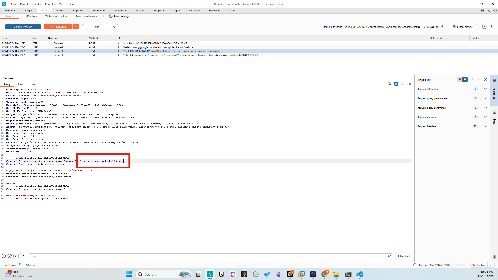
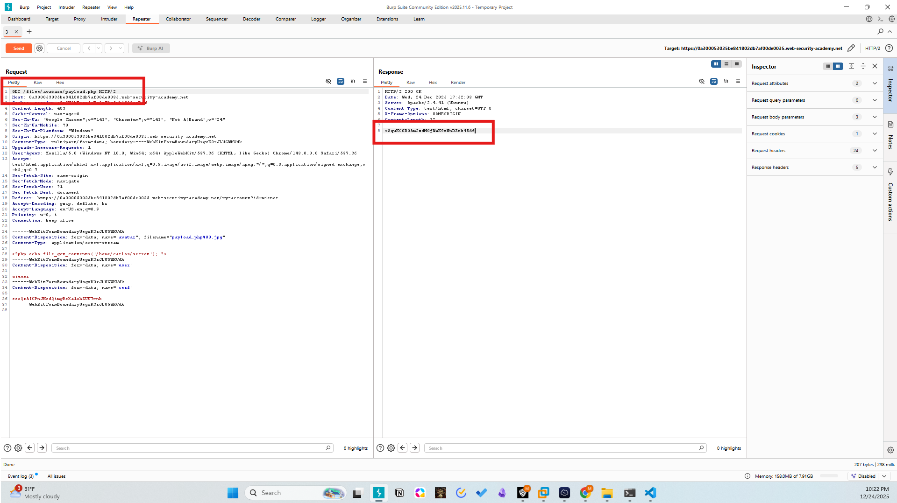
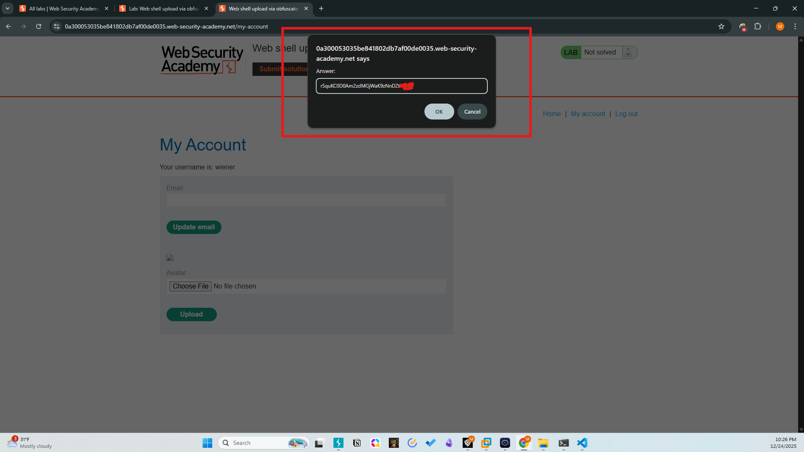
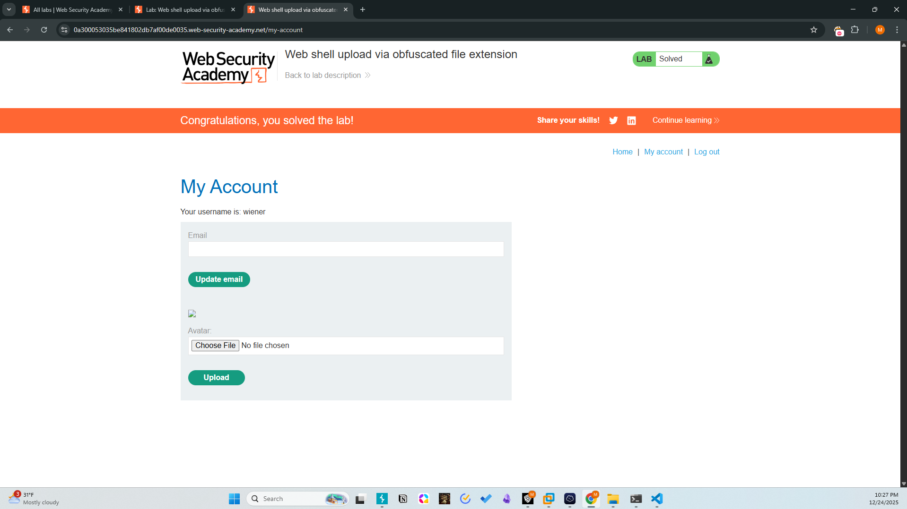

# Lab: Web shell upload via obfuscated file extension
Difficulty: Practitioner
Category: File Upload / Obfuscation

# Description
The application uses a blacklist to prevent .php uploads but fails to account for null byte injection or filename truncation. By injecting a null byte (%00) followed by a legitimate image extension, the validation logic is bypassed while the file remains executable on the server.

# Methodology
1. Initial Access: Authenticated as wiener:peter.
2. Identification: Direct .php uploads are blocked.
3. Exploitation:
- Intercepted the upload request in Burp Suite.
- Modified the filename parameter to payload.php%00.jpg.
- The server's validation logic saw the .jpg extension after the null byte and allowed the upload.
4. Exfiltration:
- The filesystem (or server-side processing) truncated the filename at the null byte, saving it as payload.php.
- Accessed /files/avatars/payload.php to execute the code and retrieve /home/carlos/secret.

# Payload
```http
Content-Disposition: form-data; name="avatar"; filename="payload.php%00.jpg"
```

# Screenshots




