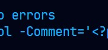
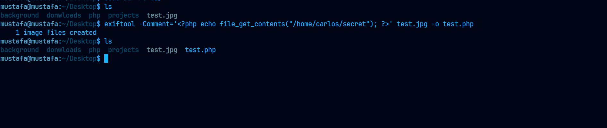
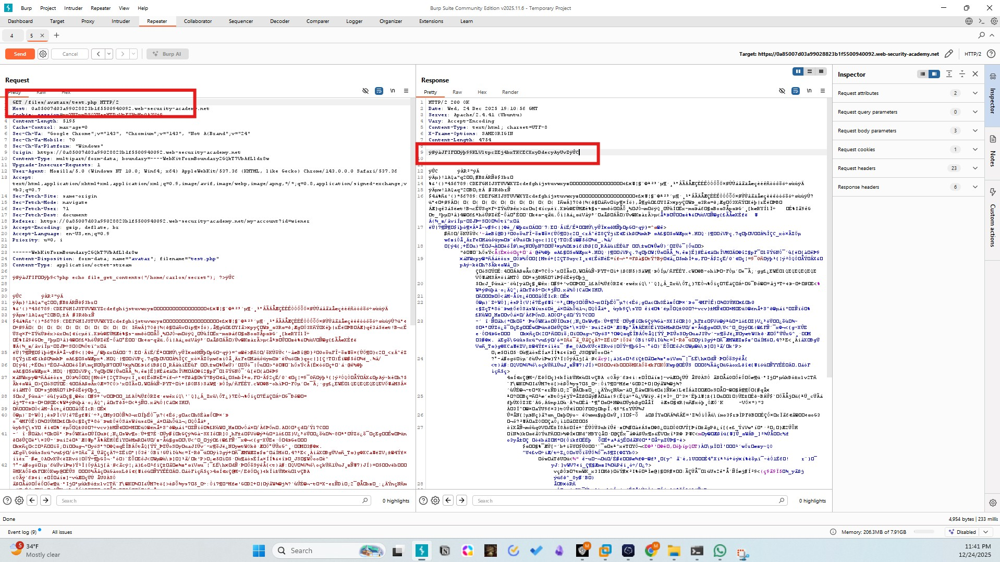
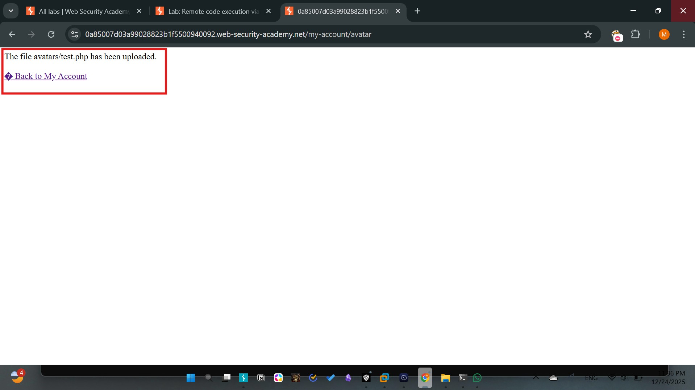
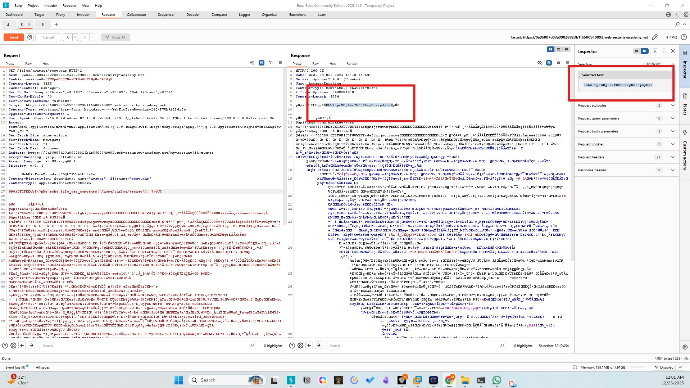
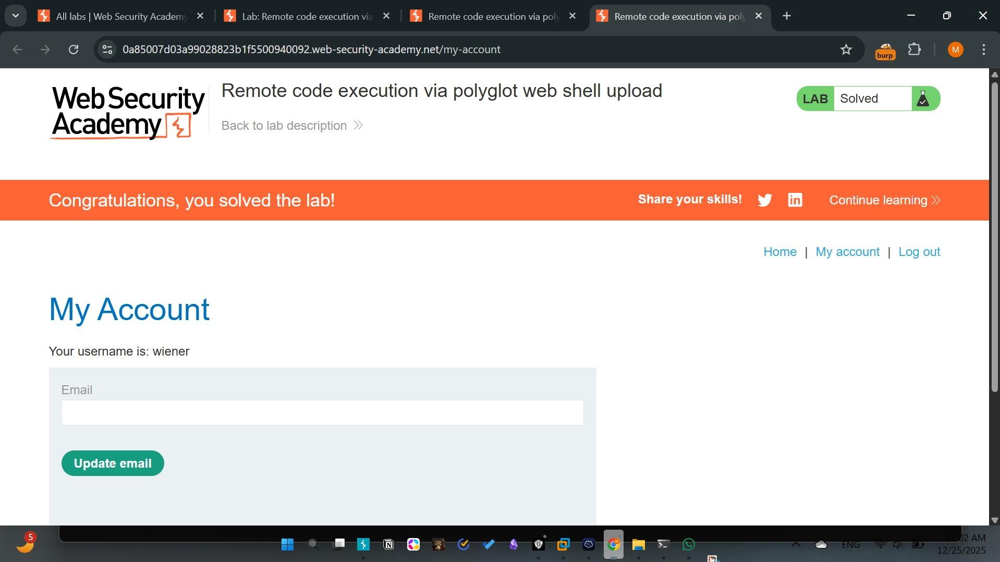

# Lab - 06: Remote code execution via polyglot web shell upload
Difficulty: Practitioner
Category: File Upload / Polyglot

# Description
The application validates file content to ensure it is a genuine image. This is bypassed using a "Polyglot" file—a file that contains a valid image header and structure but also contains executable PHP code within its metadata.

# Methodology
1. Initial Access: Authenticated as wiener:peter.
2. Vulnerability: The server uses image validation libraries (like GD) to check if the file is a valid JPEG, but it still executes .php files if they contain PHP tags.
3. Exploitation:
- Utilized exiftool to embed a PHP payload into the Comment field of a legitimate JPEG.
- Resulting file: polyglot.php (Valid JPEG signature + PHP payload).
4. Exfiltration: Accessed the file via the browser. The PHP engine scanned the file, ignored the binary JPEG data, and executed the payload in the comments, displaying the secret.

# Payload
```php
<?php echo file_get_contents('/home/carlos/secret'); ?>
```

# Screenshots





