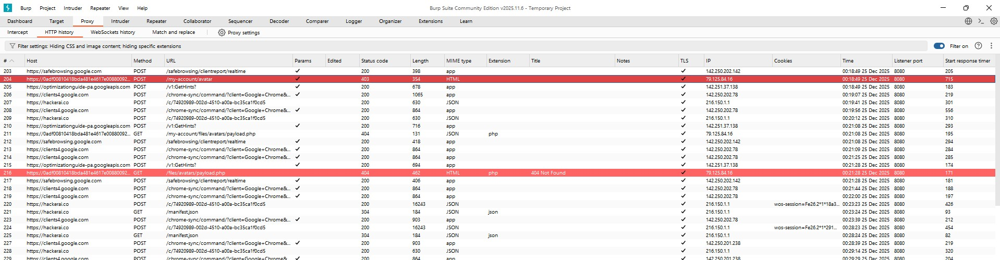
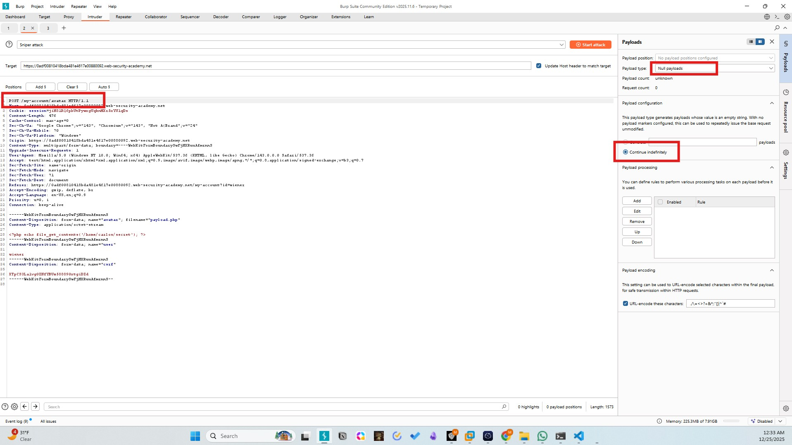
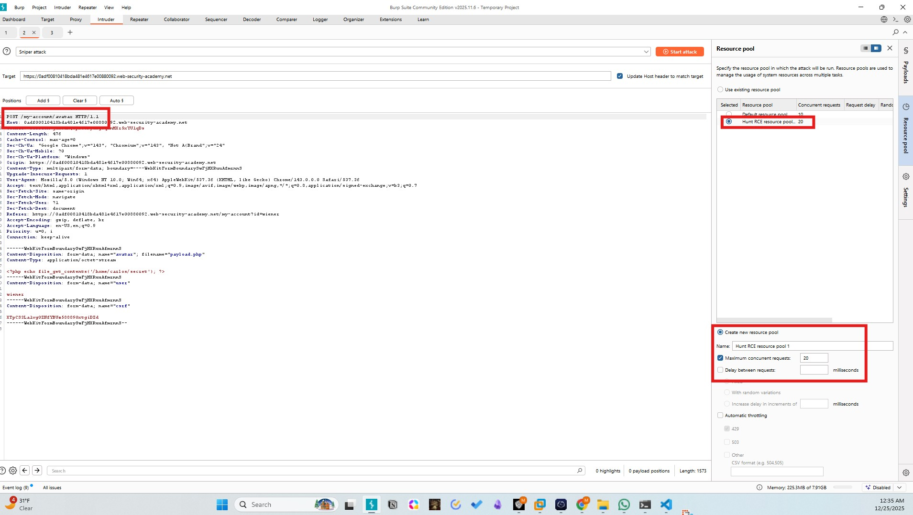
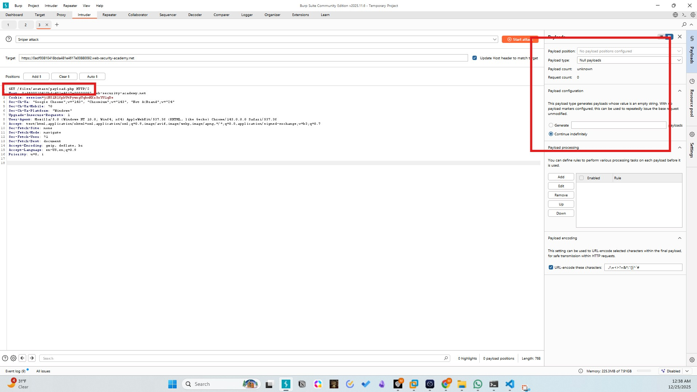
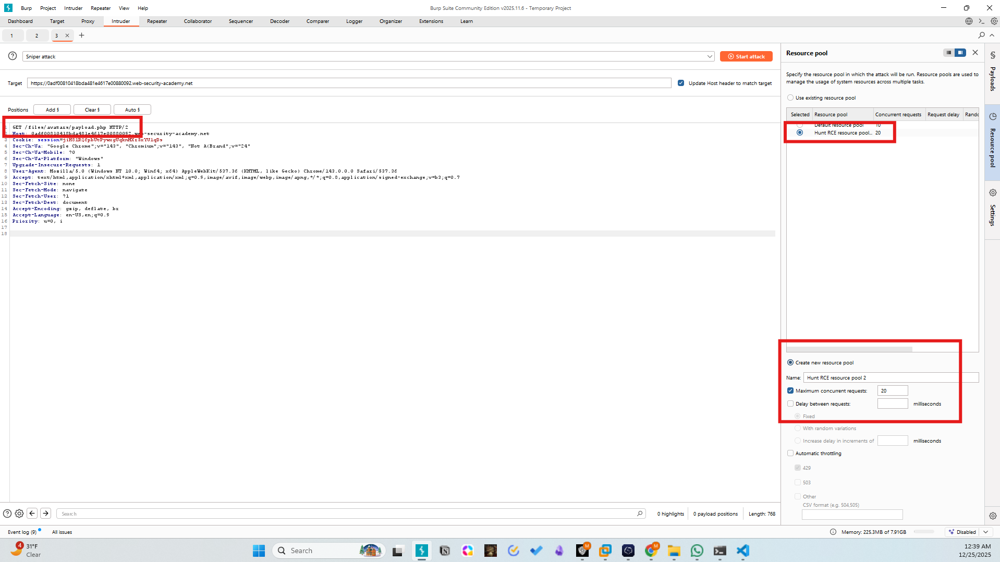
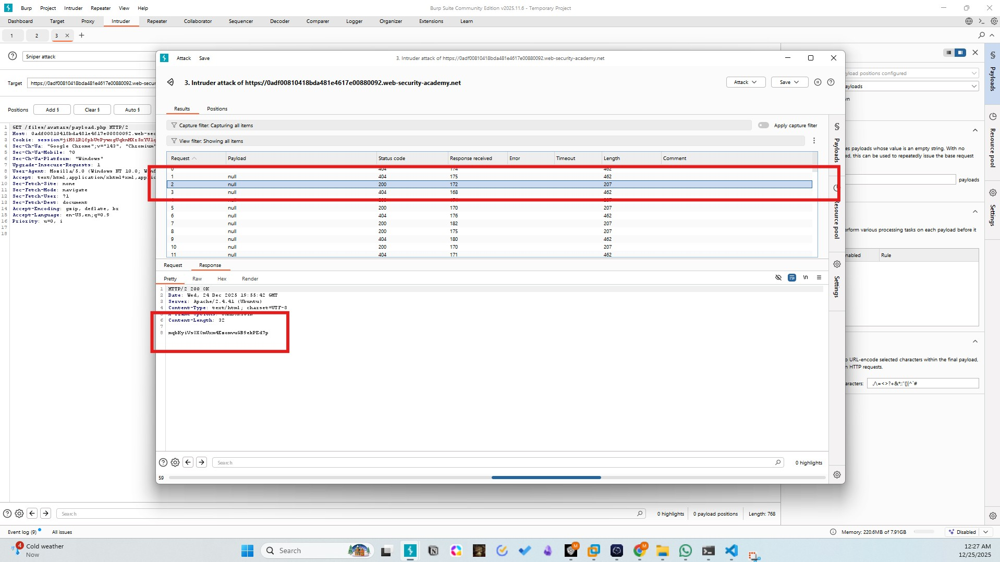
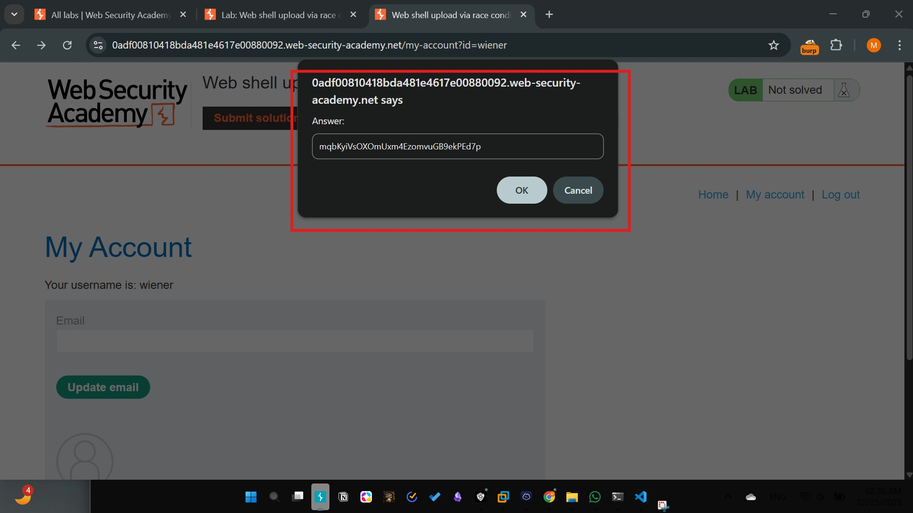
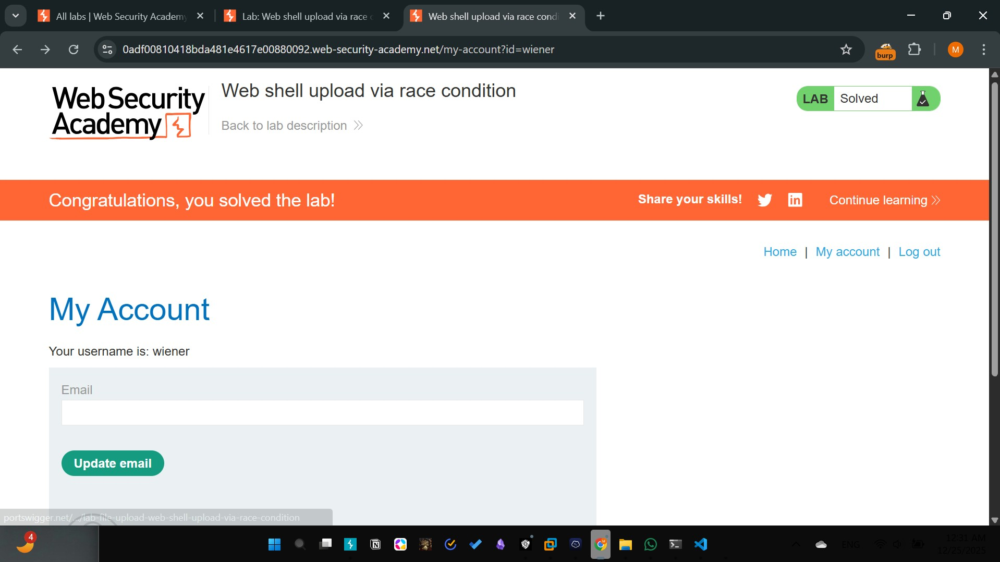

# Lab - 07 (Expert): Web shell upload via race condition
Difficulty: Expert
Category: File Upload / Race Condition (TOCTOU)

# Description
The application performs server-side validation but contains a flaw: it moves the uploaded file to a public directory before validating the file type and content. If validation fails, the file is deleted, but a small timing window exists where the file can be accessed and executed.

# Methodology
1. Initial Access: Authenticated as wiener:peter.
2. Logic Flaw Identification:
- The server uses move_uploaded_file() before calling checkFileType().
- This creates a race condition between the file's creation and its subsequent deletion (unlink).
3. Exploitation:
- Using Burp Intruder (Resource Pool)
- Send the POST upload request to Intruder.
- Send the GET /files/avatars/payload.php request to Intruder.
- Set both to "Null Payloads" and "Continue indefinitely."
- Go to the Resource Pool tab and create a new pool with Maximum concurrent requests set to 20+.
- Start both attacks at the same time.
4. Solve the lab:
- Run the attack.
- Look for a 200 OK response in the results for the GET request.
- The response body will contain the secret.

# Screenshots

