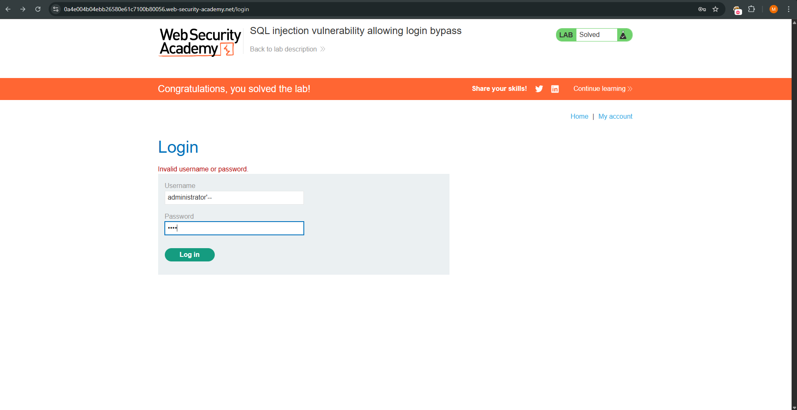
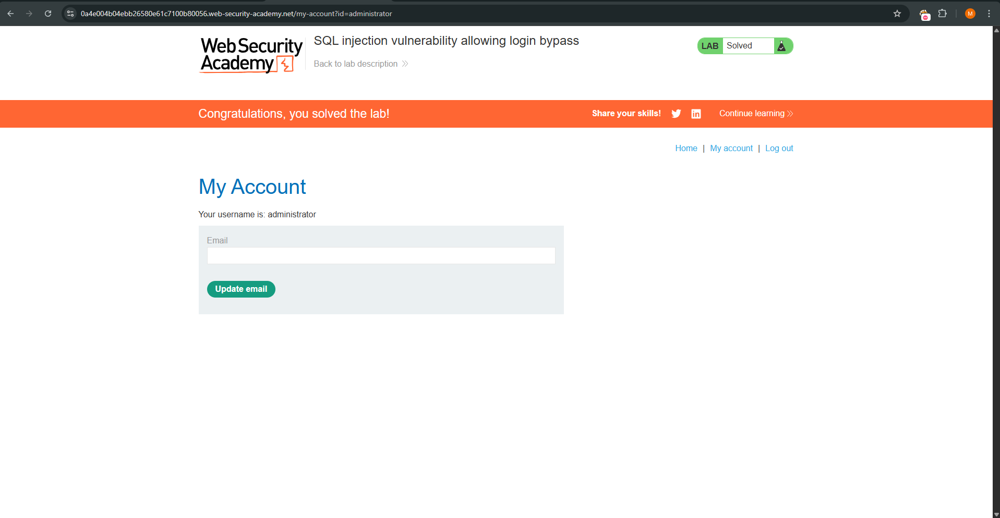

Lab: SQL Injection vulnerability allowing login bypass

This lab contains a SQL injection vulnerability in the login function. The goal is to exploit this flaw to bypass authentication and log in as the administrator user.

---

# Steps to Reproduce
1. Intercept the Login Request
- Use Burp Suite to capture the login POST request (e.g., to /login).
2. Identify the Vulnerable Field
- Locate the username field in the request body.
4. Inject the SQLi Payload
- Modify the username parameter to:
```sql
administrator'--
```
- Leave the password field unchanged or enter any value.
5. Forward the Modified Request
- Send the altered request to the server.
6. Verify Login Success
- Observe that you are now logged in as the administrator.

---

Explanation
The payload ``` administrator'-- ``` effectively changes the SQL query executed by the backend. Assuming the original query looks like this:

```sql
SELECT * FROM users WHERE username = 'administrator'--' AND password = '...'
```

-> Everything after -- is treated as a comment, so the password check is bypassed, allowing authentication to succeed.

---

# Payload Used:
```sql
administrator'--
```

---

# Screenshots



---

References

PortSwigger Lab: https://portswigger.net/web-security/sql-injection/lab-login-bypass