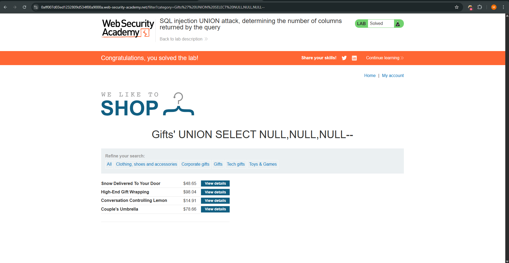

# Lab: SQL injection attack, querying the database type and version on Oracle

This lab contains a SQL injection vulnerability in the product category filter. The results of the query are returned in the application's response, making it vulnerable to a UNION-based attack. The objective is to retrieve the Oracle database version string.

Key Oracle Requirement:
In Oracle, every SELECT statement must include a FROM clause. To select constants or perform tests without a specific application table, the built-in dual table is used.

---

# Steps to Reproduce
1. Determine Column Count and Type
- Intercept the category filter request with Burp Suite.
- Test for the number of columns and ensure they can hold string data using the dual table:
```sql
'+UNION+SELECT+'abc','def'+FROM+dual--
```
- Confirmed: The query returns two columns, both capable of displaying text.
2. Retrieve Database Version
- Use the Oracle-specific dynamic performance view v$version to fetch the BANNER column, which contains the version information.
- Inject the following payload into the category parameter:
```sql
'+UNION+SELECT+BANNER,+NULL+FROM+v$version--
```
3. Verify the Output
- Forward the request and observe the database version string (e.g., Oracle Database 11g Express Edition...) rendered in the web page.

---

# Explanation
- ```UNION SELECT:``` Appends the results of our malicious query to the results of the original query.
- ```FROM dual:``` A special one-row, one-column table present by default in all Oracle installations, used here to satisfy Oracle's mandatory FROM syntax during the initial column probe.
- ```v$version:``` A standard Oracle view used to identify the version of the database instance.
- ```BANNER:``` The specific column name within v$version that holds the descriptive version string.

---

# Payload Used
Step 1 (Probe):
```sql
'+UNION+SELECT+'abc','def'+FROM+dual--
```
Step 2(Exploit):
```sql
'+UNION+SELECT+BANNER,+NULL+FROM+v$version--
```

---

# Screenshots



---

# References
- PortSwigger Lab: https://portswigger.net/web-security/sql-injection/examining-the-database/lab-querying-database-version-oracle
- SQL Injection Cheat Sheet: https://portswigger.net/web-security/sql-injection/cheat-sheet