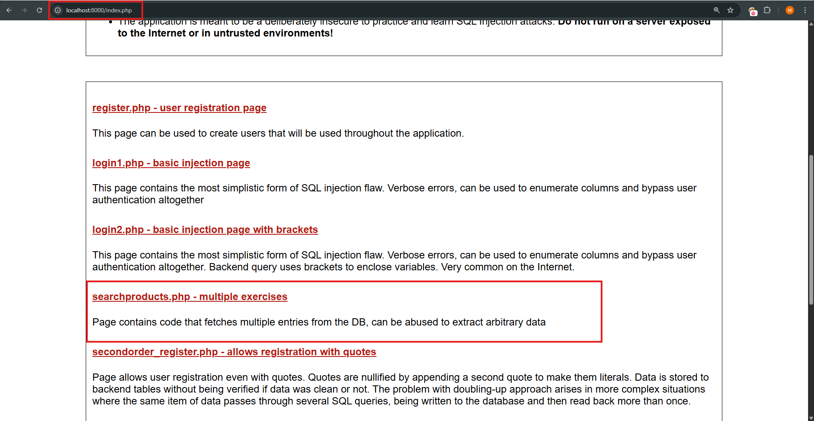
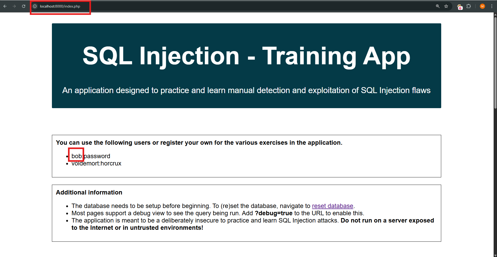
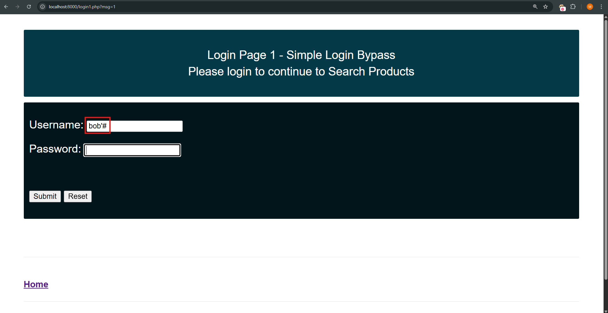
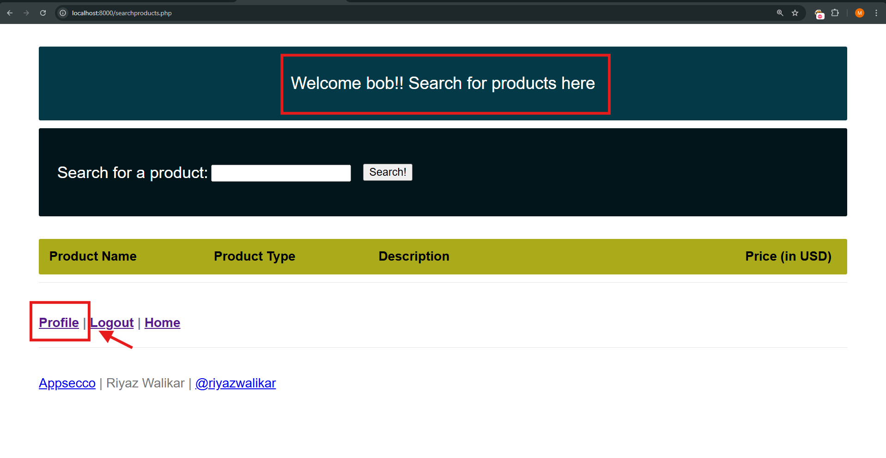
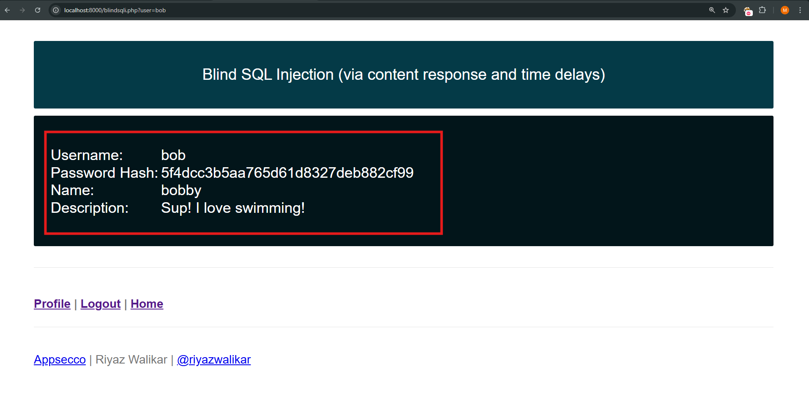

# SQL Injection - Simplest SQLi

## Description
This is an introductory SQL injection challenge where the goal is to bypass authentication by injecting a simple payload into a login form.

## Steps to Reproduce

1. Navigate to the login page.
2. Identify the vulnerable input fields: `username` and `password`.
3. Inject the following payload into the username field:

-> bob'#

4. Leave the password field blank or enter any value.
5. Submit the form.

## Payload Used
bob'#

## Explanation
The payload `bob'#` effectively changes the SQL query to:

```sql
SELECT * FROM users WHERE username='admin'--' AND password='...';*
```
Everything after -- is commented out, thus bypassing the password check.

Screenshots






Mitigation
Use parameterized queries or prepared statements.
Validate and sanitize all user inputs.
Apply the principle of least privilege for database accounts.

---

## 📄 Payload File: `payload.txt`